[](https://github.com/FabianPlum/OmniTrax/releases)
[](https://github.com/FabianPlum/OmniTrax)
[](https://www.python.org/)
[](https://app.travis-ci.com/github/FabianPlum/OmniTrax)


 

Deep learning-based multi animal tracking and pose estimation Blender Add-on.
***

&nbsp;<br>


_automated multi animal tracking example (trained on [synthetic data](https://github.com/FabianPlum/FARTS))_

Leveraging openly available or custom-trained YOLO and DeepLabCut networks, this Blender Add-on enables straight forward user interaction to automatically evaluate or annotate large video files containing hundreds of animals, requiring minimal prior experience. Estimated tracks can be edited, iteratively refined, and exported. We additionally provide basic evaluation python scripts to visualise and plot trajectories.

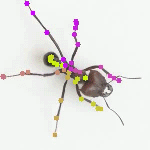 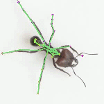

_Pose estimation and skeleton overlay example (trained on [synthetic data](https://github.com/FabianPlum/FARTS))_

[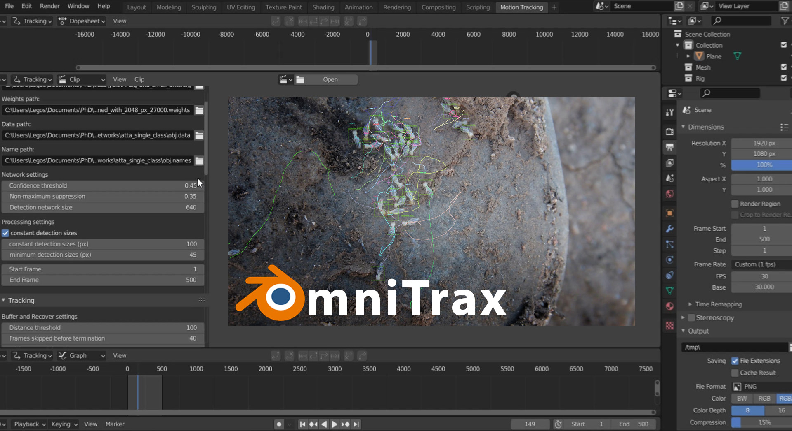](https://youtu.be/YXxM4QRaCDU)

## Updates:
* 11/10/2023 - Added [**release** version 0.3.0](https://github.com/FabianPlum/OmniTrax/releases/tag/V_0.3.0) minor fixes, major Ubuntu support! (well, on CPU at least)
* 02/07/2023 - Added [**release** version 0.2.3](https://github.com/FabianPlum/OmniTrax/releases/tag/V_0.2.3) fixing prior issues relating to masking and yolo path handling.
* 26/03/2023 - Added [**release** version 0.2.2](https://github.com/FabianPlum/OmniTrax/releases/tag/V_0.2.2) which adds support for **footage masking** and **advanced sample export** (see [tutorial-tracking](https://github.com/FabianPlum/OmniTrax/blob/main/docs/tutorial-tracking.md) for details).
* 28/11/2022 - Added [**release** version 0.2.1](https://github.com/FabianPlum/OmniTrax/releases/tag/V_0.2.1) with updated YOLO and DLC-live model handling to accomodate for different file structures.
* 09/11/2022 - Added [**release** version 0.2.0](https://github.com/FabianPlum/OmniTrax/releases/tag/V_0.2.0) with improved DLC-live pose estimation for single and multi-animal applications.
* 02/11/2022 - Added [**release** version 0.1.3](https://github.com/FabianPlum/OmniTrax/releases/tag/V_0.1.3) which includes improved tracking from previous states, faster and more robust track transfer, building skeletons from DLC config files, improved package installation and start-up checks, a few bug fixes, and GPU compatibility with the latest release of [Blender LTS 3.3](https://www.blender.org/download/lts/3-3/)!   For CPU-only inference, continue to use **Blender 2.9.2**.
* 06/10/2022 - Added [**release** version 0.1.2](https://github.com/FabianPlum/OmniTrax/releases/tag/V_0.1.2) with GPU support for latest [Blender LTS 3.3](https://www.blender.org/download/lts/3-3/)! For CPU-only inference, continue to use **Blender 2.9.2**.
* 19/02/2022 - Added [**release** version 0.1.1](https://github.com/FabianPlum/OmniTrax/releases/tag/V_0.1.1)! Things run a lot faster now and I have added support for devices without dedicated GPUs. 
* 06/12/2021 - Added the first [**release** version 0.1](https://github.com/FabianPlum/OmniTrax/releases/tag/V_0.1)! Lots of small improvements and mammal fixes. Now, it no longer feels like a pre-release and we can all give this a try. Happy Tracking!
* 29/11/2021 - Added [**pre-release** version 0.0.2](https://github.com/FabianPlum/OmniTrax/releases/tag/V_0.0.2), with [DeepLabCut-Live](https://github.com/DeepLabCut/DeepLabCut-live) support, tested for **Blender 2.9.2** only
* 20/11/2021 - Added [**pre-release** version 0.0.1](https://github.com/FabianPlum/OmniTrax/releases/tag/V_0.0.1), tested for **Blender 2.9.2** only

## Installation Guide
### Requirements / Notes
* **OmniTrax GPU** is currently only supported on **Windows 10 / 11**. For Ubuntu support on CPU, use [**Blender version 2.9.2**](https://download.blender.org/release/Blender2.92/) and skip the steps on CUDA installation.
* download and install [Blender LTS 3.3](https://www.blender.org/download/lts/3-3/) to match dependencies. If you are planning on running inference on your CPU instead (which is considerably slower) use [**Blender version 2.9.2**](https://download.blender.org/release/Blender2.92/).
* As we are using **tensorflow 2.7**, to run inference on your GPU, you will need to install [CUDA 11.2](https://developer.nvidia.com/cuda-11.2.0-download-archive?target_os=Windows&target_arch=x86_64&target_version=10&target_type=exelocal) and [cudNN 8.1](https://developer.nvidia.com/rdp/cudnn-archive). Refer to [this](https://www.tensorflow.org/install/source#gpu) official guide for version matching and installation instructions.
* When installing the **OmniTrax** package, you need to run **Blender** in **admnistrator mode** (on **Windows**). Otherwise, the additional required python packages may not be installable.

### Step-by-step installation
1. Install [Blender LTS 3.3](https://www.blender.org/download/lts/3-3/) from the official website. Simply download [blender-3.3.1-windows-x64.msi](https://www.blender.org/download/release/Blender3.3/blender-3.3.1-windows-x64.msi/) and follow the installation instructions.

2. Install [CUDA 11.2](https://developer.nvidia.com/cuda-11.2.0-download-archive?target_os=Windows&target_arch=x86_64&target_version=10&target_type=exelocal) and [cudNN 8.1.0](https://developer.nvidia.com/rdp/cudnn-archive). Here, we provide a separate [CUDA installation guide](docs/CUDA_installation_guide.md). If you already have a separate CUDA installation on your system refer to [this](https://www.tensorflow.org/install/source#gpu) official guide for version matching and additional installation instructions.

3. Download the latest release [](https://github.com/FabianPlum/OmniTrax/releases) of [OmniTrax](https://github.com/FabianPlum/OmniTrax/releases/download/V_0.2.3/omni_trax.zip). **No need to unzip** the file! You can install it straight from the **Blender > Preferences > Add-on** menu in the next step.

4. Open **Blender** in administrator mode. You only need to do this once, during the installation of **OmniTrax**. Once everything is up and running you can open **Blender** normally in the future. 

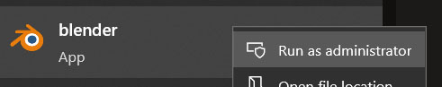

5. Open the Blender system console to see the installation progress and display information.

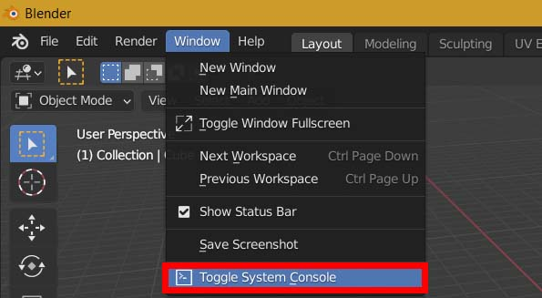

6. Next, open **(1) Edit** > **(2) Preferences...** and under **Add-ons** click on **(3) Install...**. Then, locate the downloaded **(4) omni_trax.zip** file, select it, and click on **(5) Install Add-on**.

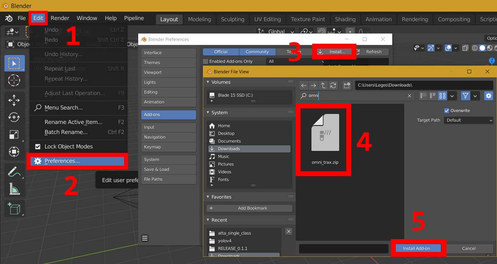

7. The **omni_trax** Add-on should now be listed. Enabling the Add-on will start the installation process of all required python dependencies. 

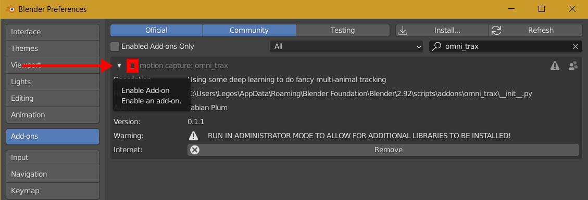

This will take quite a while, so have a look at the **Blender Console** to see the progress. Grab a cup of coffee (or tea) in the meantime. 

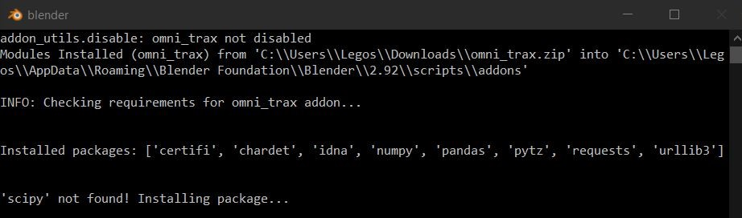

There may be a few **warnings** displayed throughout the installation process, however, as long as no errors occur, all should be good. If the installation is successful, a **check mark** will be displayed next to the Add-on and the console should let you know that "[...] all looks good here!". Once the installation is completed, you can launch blender with regular user-privileges.

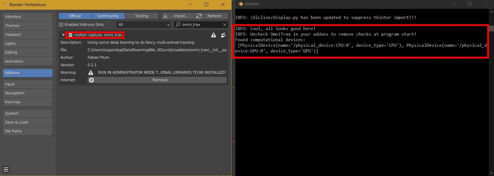

### A quick test drive (Detection & Tracking)

_For a more detailed guide, refer to the **[Tracking](docs/tutorial-tracking.md)** and **[Pose-Estimation](docs/tutorial-pose-estimation.md)** documents._

0. If you don't already have suitable videos at hand, grab some from the list of [example footage](docs/example_footage.md)

1. Let's create a new **Workspace** from the **VFX  >  Motion_Tracking** tab.

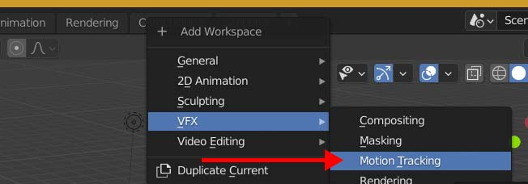

2. Time to select your compute device! If you have a **CUDA supported GPU** *(and the CUDA installation went as planned...)*, make sure your **GPU is selected** here, **before** running any of the inference functions, as the compute device cannot be changed at runtime.

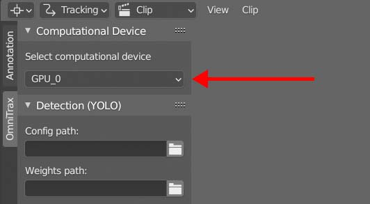

3. Now it's time to load one of your [YOLO](https://github.com/AlexeyAB/darknet) networks (or one of our pre-trained YOLO networks, see below). Next, load a video you wish to analyse from your drive by clicking on **Open**.

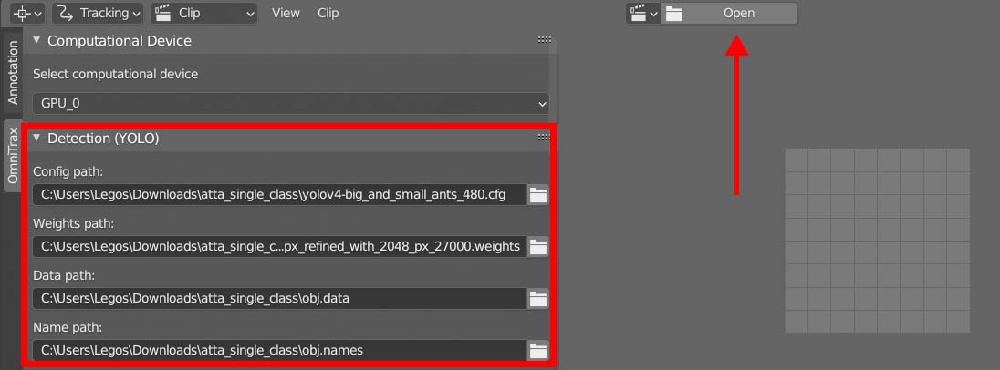

**ATTENTION:** Versions 0.2.x and later no longer require **.data** and **.names** files, making their provision optional. Configuration files will also be re-generated when changing the network input resolution.

**EXAMPLE:  *obj.data*** from [single class ant detector (trained on synthetic data)](https://drive.google.com/drive/folders/1PSseMeClcYIe9dcYG-JaOD2CzYceiWdl?usp=sharing)

```bash
classes = 1
train = data/train.txt
test = data/test.txt
names = C:/Users/Legos/Downloads/atta_single_class/obj.names
backup = backup/
```

4. Now, configure the **Detector** and **Tracker** to your liking. When you are done, click on **RESTART Track** (or **TRACK** to continue tracking from a later point in the video). Click on the video (which will open in a separate window) and press **q** to terminate the tracking process early.  

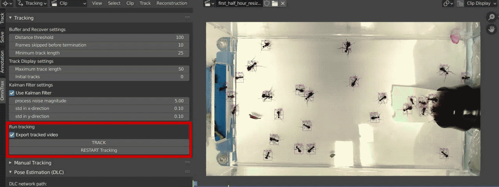
 
*NOTE: The ideal settings will always depend on your footage, especially on the relative animal size and movement speed. Remember, **GIGO** (Garbage In Garbage Out) so ensuring your recordings are evenly-lit, free from noise, flickering, and motion blur, will go a long way to improve inference quality.*

## User guides
* [CUDA installation instructions](docs/CUDA_installation_guide.md)
* Tutorial : [Multi-Animal Tracking](docs/tutorial-tracking.md)
* Tutorial : [Single- & Multi-Animal Pose-Estimation](docs/tutorial-pose-estimation.md)

## Trained networks and config files 
We provide a number of trained YOLOv4 and DeepLabCut networks to get started with OmniTrax: [trained_networks](docs/trained_networks.md)

## Example Video Footage
Additionally, you can download a few of our video examples to get started with OmniTrax: [example_footage](docs/example_footage.md)

## Upcoming feature additions
* add option to ```exclude last N frames``` from tracking, so interpolated tracks do not influence further analysis
* add ```bounding box stabilisation``` for YOLO detections (using moving averages for corner positions)
* add option to ```exit pose estimation``` completely while running inference (important when the number of tracks is 
large)
* add a **progress bar** for all tasks

***
## License
© Fabian Plum, 2023
[MIT License](https://choosealicense.com/licenses/mit/)
