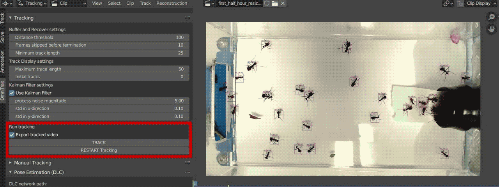

**OmniTrax - Tutorial : Tracking**
***

**OmniTrax** is a deep learning-based interactive multi-animal tracking and pose-estimation tool. It combines Buffer-and-Recover tracking with 
**Blender**'s internal **Motion Tracking** pipeline to streamline the annotation and analysis process of large video files with 
thousands of individuals. Integrating [DeepLabCut-Live](https://github.com/DeepLabCut/DeepLabCut-live) into this pipeline makes 
it possible to additionally run marker-less pose-estimation on arbitrary numbers of animals, leveraging the existing 
[DLC-Model-Zoo](https://www.mackenziemathislab.org/dlc-modelzoo), as well as our own custom [trained networks](trained_networks.md). 

Alongside **OmniTrax** we offer a selection of [example video](example_footage.md) footage and [trained networks](trained_networks.md). 
To curate your own datasets, as well as train further custom networks, refer to the official [YOLO](https://github.com/AlexeyAB/darknet) 
as well as [DeepLabCut](https://github.com/DeepLabCut/DeepLabCut) documentation.

# Tutorial : Tracking

_This tutorial assumes that you have successfully [installed **OmniTrax**](../README.md) and have enabled the **OmniTrax Add-on**_

## 1. Open [Blender](https://www.blender.org/download/lts/3-3/) and start a new project

Create a new **Workspace** from the **VFX  >  Motion_Tracking** tab.
If you don't already have suitable videos at hand, grab some from the list of [example footage](docs/example_footage.md)
.
In this tutorial, we are going to use an example recording of [herbivorous leafcutter ants](..images/example_ant_recording.mp4),
and one of our [custom trained YOLOv4 networks](https://drive.google.com/drive/folders/1PSseMeClcYIe9dcYG-JaOD2CzYceiWdl?usp=sharing).

Remember to occasionally save your project as you go along.


### NOTE: System Console

_We recommend keeping the Blender **System Console** open while using **OmniTrax** to monitor the tracking progression
and make spotting potential issues easier.
Simply cick on **Window** > **Toggle System Console** to open it in a separate window (repeat the process to close in
again)_

## 2. Select your computational device

If you have a **CUDA supported GPU** *(and the [CUDA installation](CUDA_installation_guide.md) went as planned...)*, 
make sure your **GPU is selected** here, **before** running any of the inference functions, as the computational device 
cannot be changed at runtime.


## 3. Load trained [YOLO](https://github.com/AlexeyAB/darknet) network

In this example, we are going to use one of [our YOLO networks](example_footage.md), trained on [synthetically generated 
image samples](https://github.com/FabianPlum/FARTS). Next, load a video you wish to analyse from your drive by clicking on **Open**.
We are going to use the file [_example_ant_recording.mp4_](../images/example_ant_recording.mp4).


**ATTENTION:** Double check the *"names="* filepath in the **obj.data** file points to the **absolute** location of
the **obj.names** file. Otherwise, **Blender** may crash when running tracking without telling you why.

**EXAMPLE:  *obj.data***
from [single class ant detector (trained on synthetic data)](https://drive.google.com/drive/folders/1PSseMeClcYIe9dcYG-JaOD2CzYceiWdl?usp=sharing)

```bash
classes = 1
train = data/train.txt
test = data/test.txt
names = C:/Users/Fabi/Downloads/atta_single_class/obj.names
backup = backup/
```

***NOTE***: _Make sure to save your trained networks in a file path **without** blank spaces._

## 4. Configuring the Detector

**OmniTrax** uses [YOLO](https://github.com/AlexeyAB/darknet) to produce input bounding boxes and class predictions for
its detection-based buffer-and-recover tracker. The following settings need to be configured to match the requirements
of your chosen video footage. 

* **Network settings** :
  * **Confidence threshold** : Detection confidence threshold. A higher confidence threshold value will reduce the number
      of false positives but may lead to more frequent missed detections.
  * **Non-maximum suppression** : Non-maximum suppression (NMS) refers to the maximum overlap allowed between proposed bounding boxes. 
      E.g., a value of 0.45 corresponds to a maximum overlap of 45% between two compared bounding boxes to be retained simultaneously. 
      In case the overlap is larger, the box with the lower objectness score (or classification confidence) will be _suppressed_, thus, 
      only the highest confidence prediction is returned for the given area.
* **Processing settings** :
  * **Constant detection sizes** : If enabled, enforces constant detection sizes. 
      This **does not** affect the actual inference, only the resulting bounding boxes.
  * **Constant detection sizes (px)** : Constant detection size in pixels. 
      All resulting bounding boxes will be rescaled to this value in both width and height.
  * **minimum detection sizes (px)** : If the width or height of a detection is below this threshold, it will be discarded. 
      This can be useful to decrease noise without raising the **confidence threshold**. Keep this value at 0 if this is not needed. 
  * **Start Frame / End Frame** : First / Last Frame(s) of the playback/tracking range. 

## 5. Configuring the Tracker

We employ a detection-based buffer-and-recover Tracker, using a [Kalman-Filter](https://en.wikipedia.org/wiki/Kalman_filter) to 
extrapolate and refine the motion of tracks and the [Hungarian Algorithm](https://en.wikipedia.org/wiki/Hungarian_algorithm) to match 
existing tracks with new detections for each frame. The resulting tracker implementation automatically starts as well as terminates 
arbitrary numbers of tracks and updates their state for every processed frame.

* **Buffer and Recover settings** :
  * **Distance threshold** : Maximum squared pixel distance between a track and a detection to be considered for matching. 
  * **Frames skipped before termination** : Maximum number of frames between two detections to be associated with the same track. 
      This is to handle automated buffer-and-recover tracking as well as termination of tracks of subjects that leave the scene or 
      become occluded for long periods of time.
  * **Minimum track length** : Minimum number of tracked frames. If a track has fewer detections/frames associated with it, 
      no marker will be created for it, and no track marker will be returned.
* **Track Display settings** :
  * **Maximum trace lenght** : Maximum distance number of frames included in displayed track trace. This will only affect the
      displayed preview, not the returned track markers.
  * **Initial tracks** : Begin counting tracks from this value. This property is useful when matching specific naming conventions
      or when continuing tracking from a later point in the video to avoid ambiguity. (Keep at 0 by default)
* **Kalman-Filter settings** : 
  * **Use Kalman-Filter** : If enabled, the buffer-and-recover tracker will use a separate filter for each track to extrapolate
      the track when no detections are visible within its range and to decrease the noise in the resulting tracks.
  * **Process noise magnitude** : The inherent noise of the detection process. Higher values lead to stronger corrections of the 
      resulting track and predicted next position.
  * **std in x-direction** : standard deviation of the measurement in x-direction
  * **std in y-direction** : standard deviation of the measurement in y-direction         

## 6. Run the Tracker

Click on **RESTART Track** (or **TRACK** to continue tracking from a later point in the video).
Click on the video (which will open in a separate window) to monitor the tracking progress.
If desired, press **q** to terminate the process early.

By enabling **Export tracked video**, a **.avi** file of the tracking preview is generated in the location of the input
video on your drive.



*NOTE: The ideal settings will always depend on your footage, especially on the relative animal size and movement speed.
Remember, **GIGO** (Garbage In Garbage Out) so ensuring your recordings are evenly-lit, free from noise, flickering, and
motion blur, will go a long way to improve inference quality.*

## 7. Manual Tracking _(OPTIONAL)_

In some cases you may want to make changes to the automatically generated tracks, refine or remove them, add additional
tracks, or combine fragmented tracklets. To this end we leverage the **Blender**-internal **Motion Tracking** pipeline 
and expose some of its key functions here.

* **Marker Add / Delete** : Add additional tracks, or delete existing ones. Added tracks are automatically considered
    when continuing the automated tracking process from the current frame. (Click on **TRACK** to continue tracking)
* **Track << < / > >>** : Track selected markers, using the **Blender**-internal contrast-based tracker to advance the process
    by either individual frames (**<<** / **>>**), or continuously (**< / >**), until interrupted by the user.
* **Clear <- / ->** : Clear (selected) tracks before (**<-**) or after (**->**) the current time step.
* **Refine <- / ->** : Use the **Blender**-internal tracker to refine the selected marker positions by running the tracker from
    the track's reference frame to the current frame.
* **Merge - Join Tracks** : Join two separate tracks at the current frame. This function can be used to combine fragmented 
    tracklets into coherent tracks.

### Important **shortcuts**:

_The following shortcuts are applicable in any **Blender Panel**_

Any performed action is confirmed by clicking the **LEFT Mouse Button**.
* **G** : Move – move a selected object/marker _(e.g. move tracking marker)_
* **S** : Scale – scale a selected object/marker up or down. _(e.g. change tracking marker size)_
* **R** : Rotate – rotate a selected object/marker.

You can also add constraints to the above commands to specify their effect. 

*After* pressing any of the keys above you can additionally use:

* **X** / **Y** / **Z** : (press once) Restrict the axis in which you are performing the action.
* **CTRL** : (hold) change in discrete increments
* **SHIFT** : (hold) change in finer increments
* **CTRL** + **Z** : undo your last steps. By default, you can go back **32 steps**, 
but you can increase that number under **Edit/Preferences…/System** menu, if needed.

_For a more detailed explanation refer to [blenderMotionExport](https://github.com/FabianPlum/blenderMotionExport)._

## 8. Exporting Tracks

When the tracking process is completed you can export the resulting tracks as **.csv** files for further analysis and 
visualisation. The original export script was written by [Amudtogal](https://github.com/Amudtogal) and its current version
adapted for the [blenderMotionExport](https://github.com/FabianPlum/blenderMotionExport) add-on, integrated in **OmniTrax**.

* **Export Path** : Location on your drive where you want to write the exported tracks (.csv files).
* **Export Subdirectories** : If enabled, a separate folder will be created in the **Export Path** for every tracked video
    in your project.
* **Write Logfile** : Save the output log as a separate file in the **Export Path**
* **Start / End Frame** : Define the range between you want to export tracks
* **Export Selected / All** : Export either only the selected tracks, or all tracks for all tracked videos.

## 9. Visualising & Analysing Exported Tracks

We provide a [jupyter notebook](../example_scripts/Tracking_Dataset_Processing.ipynb) to demonstrate how the created 
tracks can be processed, analysed, and visualised. The interactive notebook is designed to compare the annotated tracks
of multiple humans to form ground truth tracks for machine learning applications or evaluate the outputs of automated
annotation approaches.


_tracking output of OmniTrax for the first 1000 frames of [example_ant_recording.mp4](..images/example_ant_recording.mp4), using
the [single class ant detector (trained on synthetic data)](https://drive.google.com/drive/folders/1PSseMeClcYIe9dcYG-JaOD2CzYceiWdl?usp=sharing)_


_generated heatmap from the [tracked outputs](../example_scripts/example_ant_recording)_ of 
 [example_ant_recording.mp4](..images/example_ant_recording.mp4)

***

## License

© Fabian Plum, 2021
[MIT License](https://choosealicense.com/licenses/mit/)
