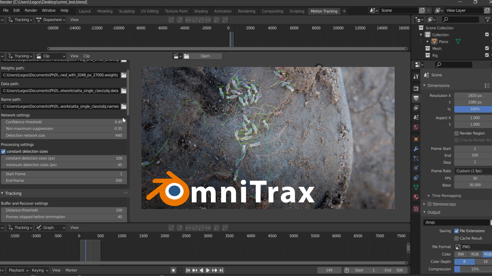

# Summary

`OmniTrax` is a deep learning-driven multi-animal tracking and pose-estimation Blender Add-on [@Blender].
`OmniTrax` provides an intuitive high-throughput tracking solution for large groups of freely moving subjects leveraging
recent advancements in deep-learning based detection [@YOLOv3; @YOLOv4] and computationally inexpensive buffer-and-recover 
tracking approaches. Combining automated tracking with the Blender-internal motion tracking pipeline allows to streamline 
the annotation and analysis process of large video files with hundreds of freely moving individuals. Additionally, 
`OmniTrax` integrates DeepLabCut-Live [@Kane2020dlclive] to enable running markerless pose-estimation on arbitrary 
numbers of animals. We leverage the existing DeepLabCut Model Zoo [@Mathisetal2018] as well as custom-trained 
detector and pose-estimator networks to facilitate large-scale behavioural studies of social animals.

# Statement of need

Deep learning-based computer vision approaches promise to transform the landscape of large-scale human and other animal 
behavioural research. The goal of `OmniTrax` is to provide an interactive inference pipeline that decreases the entry barrier 
for researchers who wish to streamline annotation and analysis processes using deep learning-driven computer vision tools.
`OmniTrax` is designed to track and infer the pose of large numbers of freely moving animals. Unlike background
subtraction, blob-detector, or optical-flow based approaches, common in multi-animal tracking [@Kalafatic2001; 
@Perez-Escudero2014; @Walter2021], the use of deep learning-based detectors allows for buffer-and-recover tracking 
in changing environments. `OmniTrax` automatically initiates new tracks
when an animal is detected for the first time and terminates the track when the animal leaves the recording site or become occluded for 
prolonged periods. `OmniTrax` uses a tuneable Kalman-Filter and the Hungarian Method for cost assignment to extrapolate 
the 2D trajectories of identified animals across frames, so that temporarily missing detections, e.g. due to occlusion, 
motion blur, or other changes in appearance, can be compensated. 

A key advantage of integrating such a pipeline into Blender is the seamless transition between automated tracking and 
iterative user-refinement. Additionally, Blender offers a number of video editing and compositing functions which make 
it possible to perform pre-processing. This includes cropping, masking, or exposure adjustment, prior to running 
inference on video footage within the same environment, without relying on external software packages.

`OmniTrax` additionally offers markerless pose-estimation through DeepLabCut-Live [@Kane2020dlclive] which enables 
extracting kinematic parameters from virtually arbitrarily large groups of individuals. We are using `OmniTrax` in ongoing research 
monitoring foraging activities of various species of leafcutter ants, tracking the movements of thousands of 
individuals to extract path choice and changes to gait patterns.

Through a library of neural networks trained on hand-annotated as well as synthetically generated samples of a number of 
digitised study organisms [@Plum2021; @Plumetal2023], we provide a range of out-of-the-box inference solutions and encourage the community 
to contribute to this emerging collection. Pre-trained detection and pose-estimation networks can be used within `OmniTrax` 
to accelerate the annotation and analysis process of large video data sets. The ease of use and focus on extendibility 
of `OmniTrax` will aid researchers in performing complex behavioural studies of social animals under laboratory as well 
as challenging field conditions.

# Acknowledgements

This study was funded by the Imperial College’s President’s PhD Scholarship (to Fabian Plum) and is part of a project 
that has received funding from the European Research Council (ERC) under the European Union’s Horizon 2020 research 
and innovation programme (Grant agreement No. 851705, to David Labonte). The funders had no role in study design, data 
collection and analysis, decision to publish, or preparation of the manuscript.

# References
